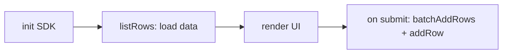

# Example: a form that reads and writes

This page ties the SDK together into one working flow: load data on start, render it, and write new rows back on submit. It is a distilled version of the [simple form template](https://github.com/seatable/seatable-html-page-template-simple-form) — a form that lists products from the base, lets the user pick quantities, and stores the result as an order.

The data flow is always the same four steps:



It assumes the three tables described in [Developer setup](getting-started.md): **Products**, **OrderItems** (link to Products), and **Orders** (link to OrderItems).

!!! tip "Just need a single file?"

    If your page is one `index.html` loading the SDK from a CDN — no build step — start
    from the [low-code quickstart](low-code-quickstart.md) instead. This example covers the
    **modular** developer structure: SDK imported from npm, logic split into modules.

!!! note "One file or modules — a maintainability choice, not a capability one"

    Modules do not unlock anything a single file cannot do — the
    [low-code quickstart](low-code-quickstart.md) reads and writes linked tables from one
    `index.html` too. Splitting into modules pays off as a page *grows*: easier to
    navigate, test and reuse. Reach for them when the file gets unwieldy, not when the
    logic gets ambitious.

## Wrap base access in a Context class

As a page grows, split the logic into modules and import the SDK from the npm package. The template's `src/esm` directory does exactly this. A common pattern is to wrap all base access in a single `Context` class, keeping SDK calls out of your UI code:

```js
import { HTMLPageSDK } from "seatable-html-page-sdk";

export default class Context {
  async init(options) {
    this.sdk = new HTMLPageSDK(options);
    await this.sdk.init();
  }

  async loadProducts() {
    const res = await this.sdk.listRows({ tableName: "Products" });
    return {
      columns: res.data.metadata,
      rows: res.data.results,
    };
  }

  async submitOrder(orderItemsData) {
    const itemsRes = await this.sdk.batchAddRows({
      tableName: "OrderItems",
      rowsData: orderItemsData,
    });
    const orderItemIds = itemsRes.data.rows.map((row) => row._id);

    await this.sdk.addRow({
      tableName: "Orders",
      rowData: { OrderItems: orderItemIds },
    });
  }
}
```

The entry point reads the injected dev config and starts the app:

```js
// index.js
import Context from "./context";

document.addEventListener("DOMContentLoaded", async () => {
  const context = new Context();
  await context.init(window.__HTML_PAGE_DEV_CONFIG__ || null);
  const { rows } = await context.loadProducts();
  // ... render rows, wire up submit -> context.submitOrder(...)
});
```

!!! tip "Linking rows"

    Notice the two-step write in `submitOrder`: first create the `OrderItems` rows with
    `batchAddRows`, then read their `_id` values from `res.data.rows` and pass them as an
    array to the `Orders` row's link column. Link columns always take an array of linked
    row IDs — see [`addRow`](sdk/rows.md#add-rows).

## Next steps

- [SDK Reference: Rows](sdk/rows.md) — full parameters and return shapes for every row method.
- [SDK Reference: Files & Images](sdk/files.md) — add file and image uploads to your form.
