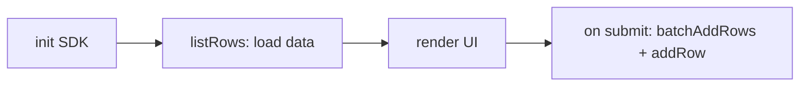

# Example: a form that reads and writes

This page ties the SDK together into one working flow: load data on start, render it, and write new rows back on submit. It is a distilled version of the [simple form template](https://github.com/seatable/seatable-html-page-template-simple-form) — a form that lists products from the base, lets the user pick quantities, and stores the result as an order.

The data flow is always the same four steps:



It assumes the three tables described in [Getting Started](getting-started.md): **Products**, **OrderItems** (link to Products), and **Orders** (link to OrderItems).

## Single-file version (non-modular)

This is the complete page. It loads the SDK from a CDN, so everything lives in one `index.html` — the non-modular style. Styling is omitted for clarity.

```html
<!DOCTYPE html>
<html lang="en">
  <head>
    <meta charset="UTF-8" />
    <title>Product Order</title>
  </head>
  <body>
    <div id="products"></div>
    <button id="submit">Submit order</button>
    <p id="status"></p>

    <script src="https://unpkg.com/seatable-html-page-sdk@latest/dist/index.min.js"></script>
    <script>
      // Quantities chosen by the user: { productRowId: quantity }
      const order = {};
      let sdk;

      async function init() {
        // In production __HTML_PAGE_DEV_CONFIG__ is undefined and the SDK
        // derives its context from the host app. In development the Vite
        // server injects it from src/setting.js. The same line works in both.
        sdk = new HTMLPageSDK(window.__HTML_PAGE_DEV_CONFIG__ || null);
        await sdk.init();

        // Read rows. The payload is under res.data (see SDK Reference > Rows).
        const res = await sdk.listRows({ tableName: "Products" });
        renderProducts(res.data.results);
      }

      function renderProducts(products) {
        const container = document.getElementById("products");
        container.innerHTML = "";

        products.forEach((product) => {
          const row = document.createElement("div");
          row.innerHTML = `
            <span>${product.Product_name} (${product.Unit_price})</span>
            <input type="number" min="0" value="0" />
          `;
          // product._id is the row ID — we need it to create the link later.
          row.querySelector("input").addEventListener("input", (e) => {
            order[product._id] = parseInt(e.target.value, 10) || 0;
          });
          container.appendChild(row);
        });
      }

      async function submitOrder() {
        const status = document.getElementById("status");

        // Build one OrderItems row per chosen product.
        const orderItemsData = Object.keys(order)
          .filter((productId) => order[productId] > 0)
          .map((productId) => ({
            Quantity: order[productId],
            // Link columns take an array of linked row IDs.
            Product: [productId],
          }));

        if (orderItemsData.length === 0) {
          status.textContent = "Please choose at least one product.";
          return;
        }

        try {
          // 1. Create the order items in one batch call.
          const itemsRes = await sdk.batchAddRows({
            tableName: "OrderItems",
            rowsData: orderItemsData,
          });

          // batchAddRows returns the created rows under res.data.rows.
          // Collect their new IDs to link them to the order.
          const orderItemIds = itemsRes.data.rows.map((row) => row._id);

          // 2. Create the order, linking the items we just created.
          await sdk.addRow({
            tableName: "Orders",
            rowData: { OrderItems: orderItemIds },
          });

          status.textContent = "Order submitted.";
        } catch (error) {
          // A 403 here usually means the API token lacks write permission.
          status.textContent = "Submit failed: " + error.message;
        }
      }

      document.getElementById("submit").addEventListener("click", submitOrder);
      document.addEventListener("DOMContentLoaded", init);
    </script>
  </body>
</html>
```

!!! tip "Linking rows"

    Notice the two-step write: first create the `OrderItems` rows with `batchAddRows`, then read their `_id` values from `res.data.rows` and pass them as an array to the `Orders` row's link column. Link columns always take an array of linked row IDs — see [`addRow`](sdk/rows.md#add-rows).

## Modular version

For anything beyond a simple page, split the logic into modules and import the SDK from the npm package. The template's `src/esm` directory does exactly this. A common pattern is to wrap all base access in a single `Context` class, keeping SDK calls out of your UI code:

```js
import { HTMLPageSDK } from "seatable-html-page-sdk";

export default class Context {
  async init(options) {
    this.sdk = new HTMLPageSDK(options);
    await this.sdk.init();
  }

  async loadProducts() {
    const res = await this.sdk.listRows({ tableName: "Products" });
    return {
      columns: res.data.metadata,
      rows: res.data.results,
    };
  }

  async submitOrder(orderItemsData) {
    const itemsRes = await this.sdk.batchAddRows({
      tableName: "OrderItems",
      rowsData: orderItemsData,
    });
    const orderItemIds = itemsRes.data.rows.map((row) => row._id);

    await this.sdk.addRow({
      tableName: "Orders",
      rowData: { OrderItems: orderItemIds },
    });
  }
}
```

The entry point reads the injected dev config and starts the app:

```js
// index.js
import Context from "./context";

document.addEventListener("DOMContentLoaded", async () => {
  const context = new Context();
  await context.init(window.__HTML_PAGE_DEV_CONFIG__ || null);
  const { rows } = await context.loadProducts();
  // ... render rows, wire up submit -> context.submitOrder(...)
});
```

## Next steps

- [SDK Reference: Rows](sdk/rows.md) — full parameters and return shapes for every row method.
- [SDK Reference: Files & Images](sdk/files.md) — add file and image uploads to your form.
