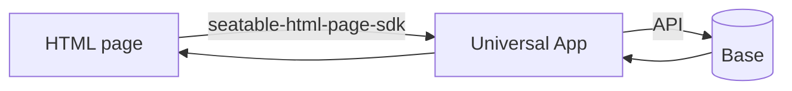

# HTML pages

Starting with SeaTable 6.2, a Universal App can contain a new page type: the **HTML page**. You upload a packaged HTML/JavaScript/CSS bundle, and SeaTable renders it as a full page inside the app.

A static bundle on its own can only display fixed content. To turn an HTML page into a real application — a custom form, a dashboard, a calculator — it needs to read from and write to the base. That data exchange runs through the [`seatable-html-page-sdk`](https://www.npmjs.com/package/seatable-html-page-sdk).

This section is written for developers. It covers how to set up a project, how to develop and package a page, and the full SDK reference.

## Architecture

An HTML page is rendered in a sandboxed context inside the Universal App. It never talks to the base directly. Instead, the SDK provides a messaging bridge to the app, which performs the actual data operations.

The SDK offers:

- **Data APIs** — list, add, update and delete rows; upload files and images.
- **Event propagation** — bidirectional events (mouse, keyboard, drag-and-drop) between the page and the app.

## Prerequisites

- SeaTable 6.2 or later.
- A Universal App with an HTML page added to it.

The developer setup additionally needs Node.js and npm, and an API token generated in the base for local development. The low-code approach needs neither.

## Two ways to build

The same kind of page can be built two ways. Pick the one that matches how you like to work — both produce the same uploadable ZIP and use the same SDK.

- :material-cursor-default-click:{ .lg .middle } __Low-code quickstart__

    ---

    Design the page in any visual (WYSIWYG) HTML editor, connect it to your base with ready-made copy-paste snippets, and upload. No Node.js, no npm, no dev server.

    Best for forms, dashboards and small tools.

    [:octicons-arrow-right-24: Low-code quickstart](low-code-quickstart.md)

- :material-code-tags:{ .lg .middle } __Developer setup__

    ---

    Clone the official template and use a full toolchain: modular files, a live-reload dev server, npm scripts and a real build.

    Best for larger or more complex pages.

    [:octicons-arrow-right-24: Developer setup](getting-started.md)

## Where to start

- [Low-code quickstart](low-code-quickstart.md) — build a page with a visual editor and copy-paste snippets, no toolchain.
- [Developer setup](getting-started.md) — set up the project, develop locally, build and upload a page. We follow the official [simple form template](https://github.com/seatable/seatable-html-page-template-simple-form) end to end.
- [SDK Reference](sdk/initialization.md) — installation, initialization, and the full API for rows, files and images.

!!! tip "Example project"

    The [`seatable-html-page-template-simple-form`](https://github.com/seatable/seatable-html-page-template-simple-form) repository contains a complete, buildable form page. It is the running example used throughout the developer setup.
