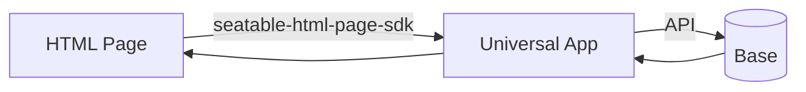

# HTML Pages

Starting with SeaTable 6.2, a Universal App can contain a new page type: the **HTML Page**. You upload a packaged HTML/JavaScript/CSS bundle, and SeaTable renders it as a full page inside the app.

A static bundle on its own can only display fixed content. To turn an HTML Page into a real application — a custom form, a dashboard, a calculator — it needs to read from and write to the base. That data exchange runs through the [`seatable-html-page-sdk`](https://www.npmjs.com/package/seatable-html-page-sdk).

This section is written for developers. It covers how to set up a project, how to develop and package a page, and the full SDK reference.

## Architecture

An HTML Page is rendered in a sandboxed context inside the Universal App. It never talks to the base directly. Instead, the SDK provides a messaging bridge to the app, which performs the actual data operations.

The SDK offers:

- **Data APIs** — list, add, update and delete rows; upload files and images.
- **Event propagation** — bidirectional events (mouse, keyboard, drag-and-drop) between the page and the app.

## Prerequisites

- SeaTable 6.2 or later.
- A Universal App with an HTML Page added to it.
- An API token generated in the base (used during local development).
- Node.js and npm for building the page.

## Where to start

- [Getting Started](getting-started.md) — set up the project, develop locally, build and upload a page. We follow the official [simple form template](https://github.com/seatable/seatable-html-page-template-simple-form) end to end.
- [SDK Reference](sdk/initialization.md) — installation, initialization, and the full API for rows, files and images.

!!! tip "Example project"

    The [`seatable-html-page-template-simple-form`](https://github.com/seatable/seatable-html-page-template-simple-form) repository contains a complete, buildable form page. It is the running example used throughout this section.
