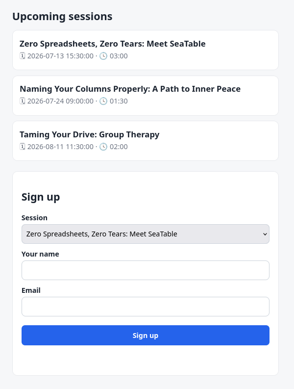
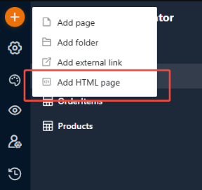
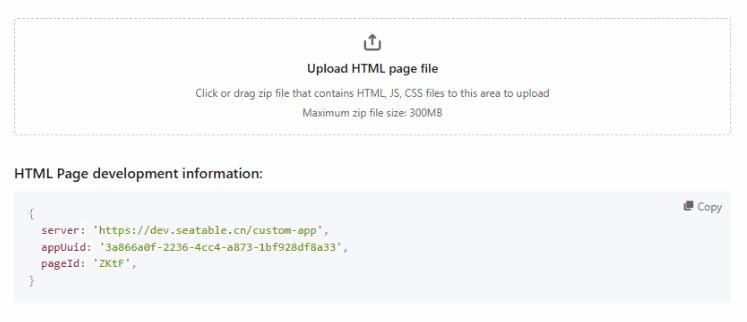

# Low-code quickstart

You do not necessarily need Node.js, npm or a development server to build an HTML page. If you can edit an HTML file and change a few names, you can publish a **custom-looking page that reads from and writes to your base** — a styled form, a landing page, a simple read-and-submit tool.

The fastest way in is not to build one from scratch. It is to **copy a page that already works and rename it** to match your base.

!!! tip "What this approach is good for"

    Custom-looking **forms, lists and info pages** that read and write the base in
    simple ways — the kind of page where the value is the *design* and *simple
    read/write*, not complex logic. If parts of your page need to **react to each
    other** (a running total, a list that reloads when a dropdown changes,
    conditional fields), that is a real application — jump to the
    [developer setup](getting-started.md) instead. See
    [When this approach stops](#when-this-approach-stops) below.

## What this page does

The example below is a small **event sign-up page**. It:

1. reads a list of upcoming **sessions** from your base and shows them as styled cards;
2. lets a visitor pick a session, type their name and email, and click **Sign up**;
3. writes that as a new row in a **Signups** table, linked back to the chosen session.



That is the whole loop: **read a table → show it → write a row back**. Everything else on this page is styling.

## Required tables

The page expects two tables. Create them as below, or rename the code (in [step 3](#3-change-the-names-to-match-your-base)) to match tables you already have.

**Sessions** — the events people can sign up for.

| Name     | Type     | Description                              |
| -------- | -------- | ---------------------------------------- |
| Title    | text     | the session name shown on the card       |
| Time     | date     | when the session takes place             |
| Duration | duration | how long it runs (comes back in seconds) |

**Signups** — one row is written here per sign-up.

| Name    | Type  | Description              |
| ------- | ----- | ------------------------ |
| Name    | text  | the visitor's name       |
| Email   | email | the visitor's email      |
| Session | link  | link to **Sessions**     |

## What you need

- A **text or visual HTML editor** — anything from Notepad/TextEdit to a WYSIWYG editor. You only need to change some text.
- A way to make a **ZIP** file (built into Windows, macOS and Linux).
- A **Universal App** where you can add an HTML page ([step 5](#5-add-an-html-page-to-your-app)).

You do not need an API token for this approach — the page gets its connection from the app once it is uploaded.

## The recipe at a glance

Building the page is eight short steps. Each one is detailed below.

1. **Copy** the code into a text editor.
2. **Save** it as `index.html`.
3. **Change** the table and column names to match your base.
4. **Zip** it — with `index.html` at the top level.
5. **Add** an HTML page to your Universal App.
6. **Upload** the ZIP.
7. **Grant** the page access to its tables.
8. **Open** the page and use it.

The two steps people miss are **3** (some names are changed differently from others) and **7** (skip it and the page loads blank). Both are spelled out below.

## 1. Copy the code into a text editor

This is the complete, working page. Copy all of it into a plain text editor (or paste it into your visual editor's code view).

```html
<!DOCTYPE html>
<html lang="en">
  <head>
    <meta charset="UTF-8" />
    <meta name="viewport" content="width=device-width, initial-scale=1.0" />
    <title>Event sign-up</title>
    <style>
      /* This is your look — change it freely, it's just CSS. */
      *, *::before, *::after { box-sizing: border-box; } /* widths include padding, so fields line up and don't overflow */
      body { font-family: system-ui, sans-serif; margin: 0; background: #f6f7f9; color: #1c2430; }
      .wrap { max-width: 640px; margin: 0 auto; padding: 24px 16px 64px; }
      h1 { font-size: 1.5rem; }
      .card { background: #fff; border: 1px solid #e6e8ec; border-radius: 12px; padding: 16px; margin: 12px 0; }
      .card h3 { margin: 0 0 4px; }
      .card p { margin: 0; color: #6b7280; }
      form { background: #fff; border: 1px solid #e6e8ec; border-radius: 12px; padding: 20px; margin-top: 24px; }
      label { display: block; font-weight: 600; margin: 12px 0 4px; }
      input, select { width: 100%; padding: 10px; border: 1px solid #cbd2da; border-radius: 8px; font-size: 1rem; }
      button { margin-top: 20px; width: 100%; padding: 12px; border: 0; border-radius: 8px;
               background: #2563eb; color: #fff; font-size: 1rem; font-weight: 600; cursor: pointer; }
      #status { text-align: center; margin-top: 12px; min-height: 1.2em; }
    </style>
  </head>
  <body>
    <div class="wrap">
      <h1>Upcoming sessions</h1>
      <div id="session-list"></div>

      <form id="signup-form">
        <h2>Sign up</h2>
        <!-- Each field has its own <label> so visitors can tell them apart. Keep them. -->
        <label for="session-select">Session</label>
        <select id="session-select"></select>
        <label for="name">Your name</label>
        <input id="name" type="text" required />
        <label for="email">Email</label>
        <input id="email" type="email" required />
        <button type="submit">Sign up</button>
        <p id="status"></p>
      </form>
    </div>

    <!-- Using the "latest" tag is not recommended for production - use a pinned version to ensure stability -->
    <script src="https://unpkg.com/seatable-html-page-sdk@0.0.13/dist/index.min.js"></script>
    <script>
      let sdk;

      // Reads EVERY row of a table (the base returns ~100 at a time) and renames the
      // columns back to the names you see in SeaTable. Leave this helper as it is.
      async function loadTable(tableName) {
        let rows = [], metadata = null, start = 0;
        while (true) {
          const res = await sdk.listRows({ tableName, start, limit: 1000 });
          metadata = metadata || res.data.metadata;
          const page = res.data.results || [];
          rows = rows.concat(page);
          if (page.length === 0) break;
          start += page.length;
        }
        const nameByKey = {};
        (metadata || []).forEach((c) => { nameByKey[c.key] = c.name; });
        return rows.map((row) => {
          const named = { _id: row._id };
          for (const key in row) if (nameByKey[key]) named[nameByKey[key]] = row[key];
          return named;
        });
      }

      // A Duration column comes back as a number of seconds — format it as HH:MM.
      // Leave this helper as it is.
      function formatDuration(seconds) {
        const h = Math.floor(seconds / 3600);
        const m = Math.floor((seconds % 3600) / 60);
        return `${String(h).padStart(2, "0")}:${String(m).padStart(2, "0")}`;
      }

      async function start() {
        sdk = new HTMLPageSDK(window.__HTML_PAGE_DEV_CONFIG__ || null);
        await sdk.init();

        // --- Read the Sessions table -------------------------------------------
        const sessions = await loadTable("Sessions");        // ← your table name (keep the quotes)

        // Show them as cards
        document.getElementById("session-list").innerHTML = sessions
          .map((s) => `<div class="card"><h3>${s.Title}</h3><p>🗓 ${s.Time} · 🕓 ${formatDuration(s.Duration)}</p></div>`)
          //                                   ↑ keep "s." — rename Title / Time / Duration to your columns
          .join("");

        // Fill the dropdown (its value is the row id, used to link the sign-up)
        document.getElementById("session-select").innerHTML = sessions
          .map((s) => `<option value="${s._id}">${s.Title}</option>`)  // ← keep s._id ; rename Title
          .join("");

        // --- Write a Signups row on submit -------------------------------------
        document.getElementById("signup-form").addEventListener("submit", async (e) => {
          e.preventDefault();
          const status = document.getElementById("status");
          try {
            await sdk.addRow({
              tableName: "Signups",                            // ← your table name (keep the quotes)
              rowData: {
                Name: document.getElementById("name").value,   // ← rename "Name" to your text column
                Email: document.getElementById("email").value, // ← rename "Email" to your email column
                Session: [document.getElementById("session-select").value],
                //  ↑ a LINK column always takes a list of row IDs — the [ ] is that list
              },
            });
            status.textContent = "Thanks — you're signed up!";
            e.target.reset();
          } catch (err) {
            status.textContent = "Something went wrong: " + err.message;
          }
        });
      }
      document.addEventListener("DOMContentLoaded", start);
    </script>
  </body>
</html>
```

## 2. Save it as `index.html`

Save the file with the exact name **`index.html`**. The name matters — this is the file SeaTable opens first. You can now edit and preview it like any web page.

## 3. Change the names to match your base

This is the one step where you touch the code — and the part where a first page usually goes wrong. **You only change names.** The rest — the whole `loadTable` helper, the structure, the `sdk` calls — stays exactly as it is.

There are **three kinds of names**, and they are changed *differently*:

| In the code                     | What it is                     | How to change it                                   |
| ------------------------------- | ------------------------------ | -------------------------------------------------- |
| `"Sessions"`, `"Signups"`       | **table names**, in quotes     | replace the text **inside** the quotes             |
| `s.Title`, `s.Time`             | **columns you read**           | keep the `s.` — replace **only** `Title` / `Time`  |
| `Name:`, `Email:`, `Session:`   | **columns you write**          | replace the whole word **before the `:`**          |

!!! warning "Keep the `s.`"

    `s` means "the current session row"; `.Title` is the column on it. So `s.Title`
    becomes `s.YourColumn` — **not** `YourColumn`. This one trips everybody up.

!!! note "Why `Session` is wrapped in `[ ]`"

    `Session` is a **link** column (it points at the Sessions table). A link column is
    always written as a **list of row IDs**, even for a single link — that is what the
    `[ ]` around the value is. The value inside (`...select-select").value`) is the id
    of the chosen session.

    Two more value facts, for when you adapt the page:

    - **Single-select / multi-select** values come back as the option **text** you see
      in SeaTable, not a hidden code.
    - For every operation and value shape, see the [SDK Reference](sdk/rows.md).

The look — all the HTML and CSS in `<style>` — is ordinary web design. Change it however you like; it cannot break the base connection. Just **keep one `<label>` per input** so visitors know which field is the name and which is the email.

Save the file again when you are done.

## 4. Zip it

!!! warning "Update resource URLs when you update the page"

    HTML pages cache JavaScript, CSS, images and other static resources for performance. When you change a resource, update its URL in `index.html` by adding a new query parameter, for example:

    ```html
    <script src="./app.js?t=1788316923728"></script>
    <link rel="stylesheet" href="./style.css?t=1788316923728">
    ```

    Use a new value each time the resource changes. Otherwise, the browser may continue to use the older cached file.

Make a **ZIP** archive that contains `index.html` at the **top level** — not inside a folder — together with any other files the page needs (images, etc.). The ZIP can have any name.

!!! warning "`index.html` must be at the root of the ZIP"

    If you zip the *folder* instead of its *contents*, `index.html` ends up one level
    down and the upload will not render. Select the files inside the folder, not the
    folder itself.

!!! warning "Keep images inside the ZIP"

    Use images you add to your page's files (they travel inside the ZIP). Images stored
    in a base **image column will not display** on an HTML page — the app blocks them
    for security.

## 5. Add an HTML page to your app

In your Universal App, add a new page and choose **Add HTML page**.



## 6. Upload the ZIP

Open the page's configuration and drag your ZIP into the **Upload HTML page file** area.



## 7. Grant table access

!!! danger "Do not skip this — it is why a fresh page shows up blank"

    In the page's settings, explicitly grant access to **each table** the page reads or
    writes (here, `Sessions` **and** `Signups`). Without this, the page uploads and loads,
    but every read returns nothing and every save is rejected — so it looks empty even
    though nothing is broken. This is the single most common reason a freshly uploaded
    page "doesn't work."

## 8. Open the page

Open the app and use the page: you should see the sessions as cards, and signing up should add a row you can find in the **Signups** table. If the page is blank, go back to [step 7](#7-grant-table-access) first.

## How it works (the mental model)

The page is **one `index.html`** with three parts:

1. The **look** — your HTML and CSS. Design it however you want.
2. The **SDK** — one `<script>` line that loads the bridge to your base.
3. The **connection** — a small script that reads a table (`loadTable`) and writes a row (`sdk.addRow`) on submit.

Everything tricky about reading data — paging past 100 rows, translating column IDs back to names — is already handled inside the `loadTable` helper, so you never touch it.

## Snippets to adapt

Once you are comfortable, this is a small catalogue to **pick from**. Each snippet is two pieces: an **HTML element** to drop into your page, and a bit of **JS** to add inside `start()` (after `sdk.init()`). Rename the quoted table names, the `s.Column` reads and the element `id`s to match your base — the same three kinds of names as in [step 3](#3-change-the-names-to-match-your-base). The snippets use this page's own `Sessions` and `Signups` tables as stand-ins.

=== "List a table as cards"

    ```html
    <div id="my-list"></div>
    ```

    ```js
    const rows = await loadTable("Sessions");                     // ← your table
    document.getElementById("my-list").innerHTML = rows
      .map((s) => `<div class="card"><h3>${s.Title}</h3></div>`)  // ← your column(s) / element id
      .join("");
    ```

=== "Fill a dropdown"

    ```html
    <select id="my-select"></select>
    ```

    ```js
    const rows = await loadTable("Sessions");                     // ← your table
    document.getElementById("my-select").innerHTML = rows
      .map((s) => `<option value="${s._id}">${s.Title}</option>`) // ← keep s._id ; rename Title
      .join("");
    ```

=== "Add a row from a form"

    Give every field its own `<label>` so visitors can tell them apart:

    ```html
    <form id="my-form">
      <label for="who">Name</label>
      <input id="who" />
      <button type="submit">Save</button>
    </form>
    ```

    ```js
    document.getElementById("my-form").addEventListener("submit", async (e) => {
      e.preventDefault();
      await sdk.addRow({
        tableName: "Signups",                                     // ← your table
        rowData: { Name: document.getElementById("who").value },  // ← your column / element id
      });
    });
    ```

=== "Update a row"

    Needs the row's `_id` — take it from a row you loaded (like `s._id`):

    ```js
    await sdk.updateRow({
      tableName: "Signups",                                       // ← your table
      rowId: someRow._id,
      rowData: { Name: "New name" },                              // ← your column
    });
    ```

=== "Delete a row"

    ```js
    await sdk.deleteRow({ tableName: "Signups", rowId: someRow._id });
    ```

For every operation and the exact value shapes, see the [SDK Reference](sdk/rows.md).

## If something doesn't work

Check these in order — they cover almost every first-upload problem:

1. **Nothing loads / a save is rejected / the page is blank.** The page is missing **table access** — grant it in the page settings ([step 7](#7-grant-table-access)). This is by far the most common cause.
2. **Only part of a big table shows.** Make sure you kept the `loadTable()` helper; it is what pages through every row.
3. **A value is wrong or empty.** Check the **column name** matches the base exactly (capitalisation included), and that you kept the `s.` on columns you read (`s.Title`, not `Title`). Select values are the visible text.
4. **A base image doesn't appear.** Image-column images can't display here — put the image in the ZIP instead.

## When this approach stops

This approach is deliberately limited to **reading and writing the base in simple, one-shot ways** with a custom look. It stops being enough the moment your page needs its parts to **react to each other** — for example:

- greying out a session once it is full — counting sign-ups against a capacity, and keeping that count right as people register;
- a total that recalculates as quantities change;
- a list that reloads when a dropdown selection changes;
- fields that appear or hide depending on another field;
- writing to several linked tables from one screen based on what the user did.

That is a genuine application, not a static page. When you reach that point, move to the [developer setup](getting-started.md): same base, same SDK, but a real project structure that can hold that logic.

## Next steps

- [SDK Reference: Rows](sdk/rows.md) — every read/write operation and the exact value shapes.
- [SDK Reference: Files & Images](sdk/files.md) — let visitors upload files from your page.
- [Developer setup](getting-started.md) — when you outgrow a single file.
